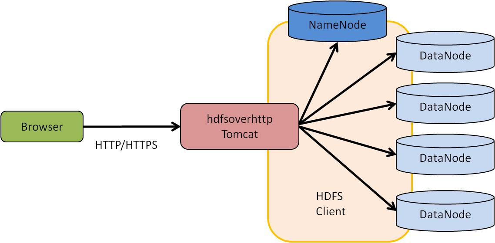
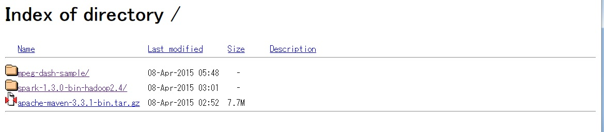
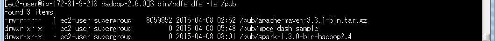

# hdfsoverhttp
This is a web appliction for downloading files on HDFS via http or https protocol  
It looks like httpd that publish the directory of local disk.

## System Architecuture

## the layout of HDFS

## Screen capture of the demo site

## Manual

### Configuration

**Use the following:**
  WEB-INF/conf/hdfs-over-http.conf  

- hdfs-uri: host and port of the Hadoop name node.  
- root-dir: top directory to publish of HDFS.  
- DirectoryIndex: the file name of directory index page,will be show if it exists.  
- HeaderName: the file name of Herder that displayed in the top of the directory and file list page.  
- ReadmeName: the file name of readme that displayed in the bottom of the directory and file list page.  

**default is the following:**
	hdfs-uri = hdfs://localhost:9000  
	root-dir = /pub  
	DirectoryIndex = index.html  
	ReadmeName = README.html  
	HeaderName = HEADER.html  

### Build

	git clone https://github.com/zhuweimin1975/hdfsoverhttp  
	cd hdfsoverhttp  
	mvn package  

	*./target/hdfsoverhttp-0.1.war will be created,you would copy this file into webapps directory of tomcat.* 

